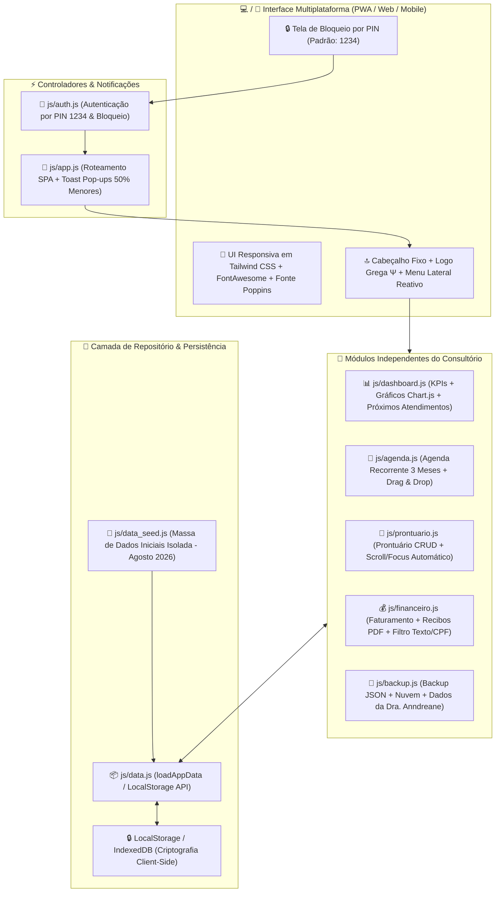

# 📑 Documentação Técnica, Arquitetura e Funcionalidades — **PsicAPP (v2.0)**
**Sistema Integrado de Gestão Clínica e Financeira para Psicólogos e Terapeutas**

---

## 📌 1. Visão Geral e Proposta de Valor

O **PsicAPP** é uma solução completa em plataforma **Web / Progressive Web App (PWA)** desenvolvida sob medida para **psicólogos, psicanalistas e terapeutas**. O sistema foi concebido com foco em **privacidade de nível médico/psicológico**, conformidade estrita com a **LGPD (Lei Geral de Proteção de Dados - Lei nº 13.709/2018)**, funcionamento **Offline-First / Local-First** e interface humanizada em tom **Dourado Nobre** e **Branco Pastel**.

**Profissional Responsável:** Dra. Anndreane Maliqui (CRP 06/123456)  
**Consultório:** Santana - São Paulo/SP  

### 📊 Benchmark de Mercado (Análise Comparativa)

| Aplicativo | Foco Principal | Limitações / Pontos Fracos | Diferencial do **PsicAPP** |
| :--- | :--- | :--- | :--- |
| **PsicoManager** | Gestão completa para psicólogos | 100% dependente de nuvem e mensalidade contínua | **Local-First + Nuvem Criptografada (Zero-Knowledge)** |
| **ZenFisio** | Clínicas de fisioterapia/psicologia | Custo recorrente elevado, sem controle local de dados | **Sem mensalidade obrigatória e backup físico local em `.json`** |
| **iClinic** | Gestão de consultórios médicos | Não permite exportação/backup individual no PC/celular | **Exportação individual e total a qualquer momento (Portabilidade LGPD)** |
| **Feegow** | Prontuários e grandes clínicas | Complexidade excessiva para consultórios individuais | **Interface minimalista, focada na rotina real do terapeuta solo** |

---

## 📐 2. Arquitetura da Aplicação & Modularização

A aplicação adota uma **Arquitetura Modular Limpa em Vanilla JavaScript ES6+**, sem dependência de frameworks pesados (Node.js, React, Webpack), garantindo alta velocidade de carregamento, facilidade de manutenção e zero tempo de compilação.



---

## 📁 3. Estrutura de Arquivos da Aplicação

```text
PsicAPP/
├── index.html                  # Shell da Interface (PsicAPP, Dra. Anndreane Maliqui, Santana - SP)
├── seed_data.json              # Banco de dados inicial JSON (Consultas a partir de Agosto/2026)
├── README.md                   # Documentação Técnica Unificada (v2.0)
└── js/
    ├── data_seed.js            # Massa de Dados Iniciais Isolada (8 Pacientes: 50% Semanal, 50% Quinzenal)
    ├── data.js                 # Camada de Repositório, LocalStorage e abstração loadAppData()
    ├── auth.js                 # Autenticação por PIN (1234) e Bloqueio de Segurança
    ├── dashboard.js            # KPIs do Consultório, Próximos Atendimentos e Gráficos Chart.js
    ├── agenda.js               # Agenda Inteligente (Dia/Semana), Recorrência Automática e Drag & Drop
    ├── prontuario.js           # Prontuário Eletrônico, CRUD Completo, Scroll e Foco sem Nota Confidencial
    ├── financeiro.js           # Gestão de Lançamentos, Filtro por Nome/CPF, Status Pago/Pendente e Recibos PDF
    ├── backup.js               # Exportação/Importação JSON, Nuvem e Dados da Profissional
    └── app.js                  # Inicializador, Roteamento SPA entre Abas e Notificações Toast (~50%)
```

---

## 🎨 4. Design System & Identidade Visual

* **Tipografia:** Google Fonts — **Poppins** (`'Poppins', sans-serif`), garantindo leitura clara, profissional e acolhedora.
* **Paleta de Cores Princiais:**
  * **Dourado Nobre (Accent):** `#c59b27` / `#d4af37` (`bg-psi-gold-gradient`). Utilizado em botões de ação primários, badges de destaque e seleções ativas.
  * **Branco Pastel Aquecido (Background):** `#faf8f5` / `#f5efe6` (`bg-pastel-bg`), reduzindo o cansaço visual em longos períodos de uso.
  * **Bordas Suaves:** `#e2d8c7` (`border-pastel-border`).
* **Símbolo da Marca:** A **letra grega Ψ (Psi)**, ícone universal da Psicologia.

---

## 🗄️ 5. Modelo de Dados & Esquema das Entidades

### 5.1. Entidade: Pacientes (`patients`)
| Campo | Tipo | Criptografia | Descrição |
| :--- | :--- | :--- | :--- |
| `id` | String | Não | Identificador único (P001, P002...) |
| `name` | String | Não | Nome completo do paciente |
| `cpf` | String | Não | CPF formatado para recibos e busca |
| `birthDate` | String (AAAA-MM-DD) | Não | Data de nascimento |
| `phone` | String | Não | Telefone/WhatsApp com DDD |
| `email` | String | Não | E-mail do paciente |
| `profession` | String | Não | Profissão / Ocupação |
| `consultationFrequency` | Enum | Não | `Avulso`, `Semanal`, `Quinzenal`, `Mensal` |
| `value` | Float | Não | Valor acordado da sessão (R$) |
| `notes` | Text | AES-256 | Queixa inicial ou anotações de contato |
| `createdAt` | String (AAAA-MM-DD) | Não | Data de cadastro |

### 5.2. Entidade: Agendamentos (`appointments`)
| Campo | Tipo | Descrição |
| :--- | :--- | :--- |
| `id` | String | ID do agendamento (A001...) |
| `patientId` | String | FK para o paciente |
| `patientName` | String | Nome do paciente |
| `date` | String (AAAA-MM-DD) | Data da consulta (A partir de 08/2026) |
| `time` | String (HH:MM) | Horário do atendimento |
| `frequency` | Enum | `Avulso`, `Semanal`, `Quinzenal`, `Mensal` |
| `status` | Enum | `Agendado`, `Atendido`, `Falta`, `Cancelado` |
| `notes` | String | Nota rápida ou lembrete |

### 5.3. Entidade: Evoluções Clínicas (`evolutions`)
| Campo | Tipo | Criptografia | Descrição |
| :--- | :--- | :--- | :--- |
| `id` | String | Não | ID do registro clínico (E001...) |
| `patientId` | String | Não | FK para o paciente |
| `date` | String (AAAA-MM-DD) | Não | Data da sessão |
| `sessionNumber` | Integer | Não | Número ordinal da sessão (#1, #2...) |
| `model` | Enum | Não | `TCC`, `Psicanálise`, `Humanista`, `Existencial`, `Comportamental` |
| `mood` | Enum | Não | Estado afetivo (*Tranquilo*, *Ansioso*, *Triste*, *Exausto*, *Motivado*, *Neutro*) |
| `content` | Text | AES-256 | Anotações clínicas e evolução do caso |

---

## 🧩 6. Módulos do Sistema & Suas Funcionalidades

### 6.1. 📊 Dashboard Geral (`js/dashboard.js`)
* **Cards de Métricas (KPIs):** Total de Pacientes Ativos, Consultas no Mês, Receita Confirmada e Pendências Financeiras.
* **3 Gráficos Interativos (Chart.js):** Atendimentos Mensais, Status das Consultas e Evolução Financeira.
* **Próximos Atendimentos:** Lista com leitor de data local (`parseLocalDate`) para evitar divergência de fuso horário.

### 6.2. 📅 Agenda Inteligente & Recorrência (`js/agenda.js`)
* **Projeção de 3 Meses:** Agendamentos `Semanal`, `Quinzenal` e `Mensal` projetados automaticamente com detecção de choques.
* **Leitor Local de Datas (`parseLocalDate`):** Previne que datas retrocedam 1 dia devido ao fuso horário UTC-3.
* **Drag & Drop Swapping:** Arrastar um card sobre outro inverte os horários dos pacientes.

### 6.3. 📂 Prontuário Eletrônico (`js/prontuario.js`)
* **Remoção de Nota Confidencial:** Campo removido do formulário e dos cards da timeline.
* **Scroll Suave & Foco Automático:** Ao clicar em "Editar Evolução", a página desliza até o topo do card `#evolutionFormCard` e coloca o cursor no textarea `#evoContentTextarea`.

### 6.4. 💰 Financeiro & Emissor de Recibos (`js/financeiro.js`)
* **Filtro em Tempo Real por Nome e CPF:** Pesquisa por escrita na tabela de lançamentos.
* **Pílula Pendente ↔ Pago:** Alternância rápida com 1 clique.
* **Recibos em PDF:** Emissão personalizada para **Dra. Anndreane Maliqui** em **Santana - São Paulo/SP**.

---

## 🚀 7. Guia de Instalação e Execução

1. Copie o arquivo **`index.html`** para a raiz do seu projeto.
2. Salve os scripts dentro da pasta **`js/`** com extensão `.js`:
   * `js/data_seed.js`
   * `js/data.js`
   * `js/auth.js`
   * `js/dashboard.js`
   * `js/agenda.js`
   * `js/prontuario.js`
   * `js/financeiro.js`
   * `js/backup.js`
   * `js/app.js`
3. Abra o `index.html` no seu navegador e digite a senha padrão: **`1234`**.
